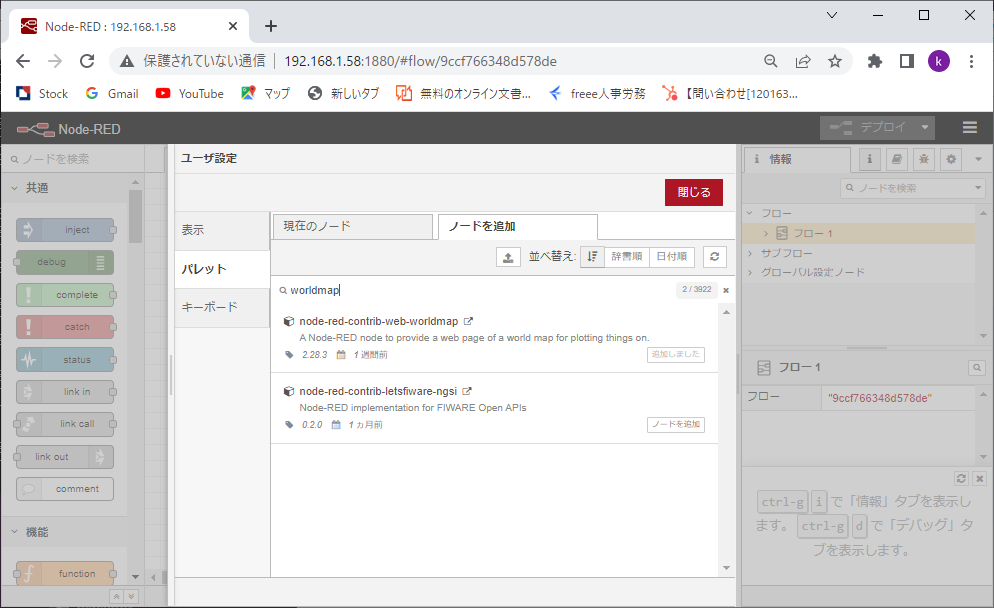

# ADRSZGP - GPS拡張基板の動作確認

### *製品ページは[こちら](http://bit-trade-one.co.jp/adrszgp/)*

### [回路図](https://github.com/bit-trade-one/RasPi-Zero-One-Series/blob/master/4th/ADRSZGP_GPS/Schematics/ADRSZGP_v11_schematics.pdf)

## ファイルリスト
* README.md ［本文書］
* node-red-gps-serial-sample.json［Node_RED作例］

## はじめに
ADRSZGP GPS拡張基板は、GPSモジュールが実装されRaspberry Pi ZEROとはGPIOのUARTで接続されています。  
下記に、基本的なインストールと動作確認方法を示します。  

## 前提条件
本動作確認は「RaspberryPI OS 32bit Bullseye 2022-04-04 Release」をイントールした後、2022年6月時点で最新版にupgradeした状態で実行しております。尚、Node-REDの作例を動作させる場合は、あらかじめNode-REDを同梱したRaspberry Pi OS Full(32bit)をインストールされることをおすすめします。<BR>
Raspberry Piの設定で、I2C、SPI、およびシリアルポートは有効にした状態です。
また、シリアルコンソールは無効のままとしてください。

```sh
    $ sudo apt-get update 
    $ sudo apt-get upgrade
# cuコマンドのインストール（未インストールの場合）
    $ sudo apt-get install cu
```

## １．動作確認
### １）GPS出力データの確認
cuコマンドによりGPSの出力データを確認してください。下記のような結果が得られれば、GPS拡張基板は正常に動作しています。
```sh
    $ cu -s 9600 -l /dev/serial0

$GPGGA,042203.000,3533.4562,N,13921.4319,E,1,8,1.00,110.2,M,39.3,M,,*5D
$GPGSA,A,3,04,03,19,01,06,17,14,09,,,,,1.35,1.00,0.91*0E
$GPRMC,042203.000,A,3533.4562,N,13921.4319,E,0.31,7.04,230622,,,A*6B
$GPVTG,7.04,T,,M,0.31,N,0.58,K,A*31
$GPGGA,042204.000,3533.4562,N,13921.4320,E,1,8,1.00,110.2,M,39.3,M,,*50
$GPGSA,A,3,04,03,19,01,06,17,14,09,,,,,1.35,1.00,0.91*0E
$GPRMC,042204.000,A,3533.4562,N,13921.4320,E,0.42,7.04,230622,,,A*62
$GPVTG,7.04,T,,M,0.42,N,0.78,K,A*37
$GPGGA,042205.000,3533.4562,N,13921.4321,E,1,8,1.00,110.2,M,39.3,M,,*50
$GPGSA,A,3,04,03,19,01,06,17,14,09,,,,,1.35,1.00,0.91*0E
$GPGSV,4,1,14,17,83,359,22,19,59,322,25,03,43,044,18,06,38,295,22*75
$GPGSV,4,2,14,04,34,104,27,09,30,143,27,14,29,205,17,01,20,073,14*7D
$GPGSV,4,3,14,11,05,273,,21,02,087,,02,02,278,,12,02,328,*73
$GPGSV,4,4,14,51,,,,193,,,*43
```
以上で本製品の動作確認は完了です。

### ２）注意事項
- コールドスタート(電源ON)時に、GPSが測位を開始できるまでには数分程度の時間が必要となることがあります。
- 本基板では、基板上に市販の2032型のボタン電池を搭載することにより、次回の電源オン時にホットスタートすることができ、測位開始までの時間を短縮することができます。

## ２．Node-REDを用いた作例
本作例の実行には、Node-REDの基本知識が必要となります。 

### １） Node-RED最新版のインストール
Node-REDを同梱したRaspberry Pi OS Full(32bit)をインストールされている場合は不要です。
```sh
    $ bash <(curl -sL https://raw.githubusercontent.com/node-red/linux-installers/master/deb/update-nodejs-and-nodered)
#node-redを自動起動する場合は下記を実行してください
    $ sudo systemctl enable nodered.service 
    $ sudo reboot
```
### ２） worldmapノードのインストール
Node-REDの右上のハンバーガーメニューから「パレットの管理」を選択し、検索バーで「worldmap」を検索し、ノードを追加します。
  


### ３） Node-REDサンプルソフトのインストール
- node-red-gps-serial-sample.jsonを、右上のハンバーガーメニューから「読み込み」を選択し、Node-REDに読込みデプロイしてください。
- デプロイ後、[Ctrl]+[Shift]+[m]キーを押すと、地図画面を表示します。

  


本作例の仕様は下記となります。 
- 入力：GPS拡張基板から、シリアルでGPSデータを入力  
- 出力：worldmap上に測位した位置を表示 <BR>

  
